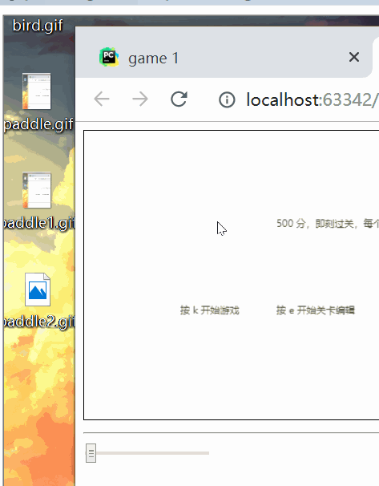
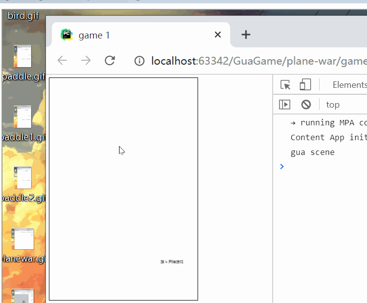
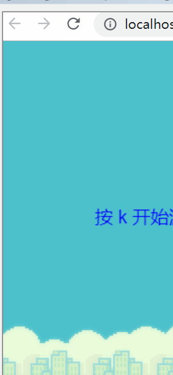
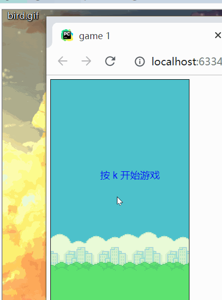

# zgame
    - 资源预加载
    - 精灵动画
    - 场景管理
    - 粒子系统
    - 双向绑定
    - 事件注册
    - 自动配置
    - 实时调试
## Paddle Ball
本游戏包含四个场景，分别为入口，游戏，结束，编辑

1. 入口处，按 k 开始游戏，按 e 进入编辑器
2. 编辑关卡，鼠标点击空白即增加砖块，点中砖块拖动可以拖动来调整位置
3. 编辑器中可以按 1-9 来编辑对应关卡，每一关卡编辑完后按 s 可以保存
4. 初始的 6 个砖块，每个有两条命，新建砖块默认 1 条命，点击砖块不拖动即可增加砖块生命值
5. 游戏按 f 发射小球，ad 控制板块滑动，每打到一次砖块 100 分，分数到 1200 时自动进入下一关
6. 游戏可以按 p 暂停，可以拖动小球位置，可以用 123 来选择前三关

## Plane War
本游戏包含三个基本场景和多个自调节设置，打开 console 可以看到更多信息

1. awsd 控制飞机移动，j 发出子弹
2. 子弹会扣 1 点血，被敌人撞机会扣敌人剩余血量的血
3. 击败敌人获得 100 分数，打掉敌人子弹获得 50 分数

## Flappy Bird
本游戏包含三个基本场景和多个自调节设置

1. awsd 控制小鸟移动，j 跳跃
2. 可以调跳跃的高度和冷却时间

